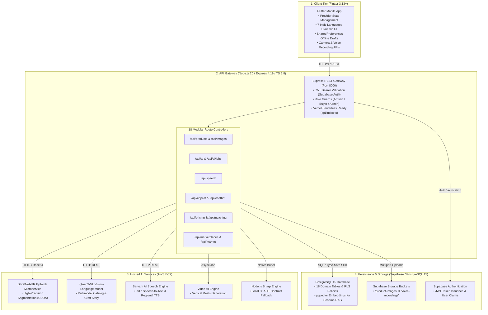
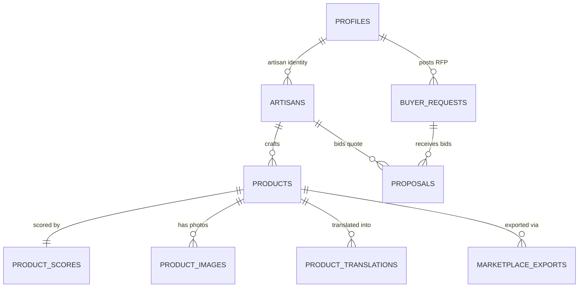

<div align="center">


# ARTISERA

### **Create. Understand. Improve. Sell.**

**An intelligent multimodal e-commerce co-pilot transforming physical handcrafted artifacts into marketplace-ready digital assets for India's marginalized artisans.**

[](https://flutter.dev)
[](https://nodejs.org)
[](https://fastapi.tiangolo.com)
[](https://supabase.com)
[](https://sih.gov.in)
[](LICENSE)

<br/>

[](https://github.com/jeevanadhithya/Artisera/releases/tag/v1.0.0)
[](https://drive.google.com/drive/folders/1EfTZqnUxiUfQ5gCGhcMhDDZhfbOp_0L-?usp=drive_link)
[](https://youtu.be/Cr4zvQM_UDc?si=m-wgKxBWd2k3LNl8)

<br/>

| 🌐 **Live Cloud API** | 🩺 **Diagnostics Portal** | 🎯 **Official Submission** |
|:---:|:---:|:---:|
| [`artisera-backend.vercel.app/api`](https://artisera-backend.vercel.app/api) | [`artisera-backend.vercel.app`](https://artisera-backend.vercel.app/) | **SIH 2026 · PS-26090** |

| 📱 **Android APK Release** | 📁 **Google Drive Assets** | 🎥 **Product Demo Video** |
|:---:|:---:|:---:|
| [**Download v1.0.0 APK**](https://github.com/jeevanadhithya/Artisera/releases/tag/v1.0.0) | [**Open Google Drive**](https://drive.google.com/drive/folders/1EfTZqnUxiUfQ5gCGhcMhDDZhfbOp_0L-?usp=drive_link) | [**Watch on YouTube**](https://youtu.be/Cr4zvQM_UDc?si=m-wgKxBWd2k3LNl8) |

</div>

---

## ⚡ How Artisera Works (At a Glance)

> [!NOTE]
> **Core Concept**: Artisera replaces complex e-commerce listing portals with a simple **camera snap and a mother-tongue voice note**. Built with Material Design 3 guidelines and an artisan terracotta palette (`#C4512D`).

```
  ┌─────────────────┐       ┌─────────────────┐       ┌─────────────────┐       ┌─────────────────┐
  │   1. CAPTURE    │  ──▶  │  2. UNDERSTAND  │  ──▶  │   3. IMPROVE    │  ──▶  │     4. SELL     │
  │ Photo + Voice   │       │ Multimodal AI   │       │ Living Wage +   │       │ B2B Matching +  │
  │ in Mother Tongue│       │ Catalog & Story │       │ Product Score   │       │ Multi-Export    │
  └─────────────────┘       └─────────────────┘       └─────────────────┘       └─────────────────┘
```

### 🎯 The 5-Step Workflow — Short & Sweet

- 📸 **Step 1: Capture & Studio Enhancement**
  - Snap raw photo on any entry-level smartphone.
  - BiRefNet-HR deep segmentation model (hosted on AWS EC2) isolates craft silhouette and removes background clutter.
  - Composites artifact onto **Warm Ivory** (`#F7F3EA`) with realistic contact shadows.
  - *Non-generative*: Preserves authentic clay, weave, and brass textures without hallucination.

- 🗣️ **Step 2: Speak in Mother Tongue**
  - Hold the mic and describe the craft naturally in your regional language.
  - Self-hosted Sarvam AI speech model (hosted on AWS EC2) transcribes speech across **7 Indic languages** (Hindi, Tamil, Telugu, Bengali, Marathi, Kannada, English).
  - Built-in TTS audio playback enables low-literacy artisans to listen to generated descriptions.

- 🧠 **Step 3: Multimodal Catalog Synthesis**
  - Qwen3-VL vision-language model (fine-tuned on Indian craft taxonomies and hosted on AWS EC2) fuses photo features + voice transcript into structured JSON.
  - Generates bilingual titles (English + Hindi), SEO keywords, dimensions, and HSN tax codes.
  - Creates an authentic **Cultural Heritage Story** that commands fair market value.

- ⚖️ **Step 4: Fair Living Wage & Quality Score**
  - Deterministic formula guarantees minimum cost floor: $\text{Materials} + (\text{Hours} \times \text{Wage}) + \text{Packaging}$.
  - Adds $+20\%$ Geographical Indication (GI) premium and craft complexity multipliers.
  - 5-dimension **Product Score (0–100)** gives actionable tips to maximize market discoverability.

- 🤝 **Step 5: Direct Market Linkage & Export**
  - Matches artisan inventory with active corporate and boutique B2B procurement RFPs.
  - One-tap download of compliant listing packages for **GeM**, **ONDC**, and **Amazon Karigar**.
  - No repeated data entry or platform compliance headaches.

---

## 📚 Table of Contents

- [🎯 Smart India Hackathon Context](#-smart-india-hackathon-context)
- [🎥 Product Demo Video & Screenshots](#-product-demo-video)
- [🔍 Problem](#-problem)
- [💡 Solution](#-solution)
- [🚀 Key Features](#-key-features)
- [👤 Artisan Journey](#-artisan-journey)
- [🧠 AI Intelligence Layer](#-ai-intelligence-layer)
- [🏗️ System Architecture](#️-system-architecture)
- [📱 Mobile Application](#-mobile-application)
- [⚙️ Backend](#️-backend)
- [🤖 AI Models & Services](#-ai-models--services)
- [🗄️ Database](#️-database)
- [📁 Repository Structure](#-repository-structure)
- [🛠️ Technology Stack](#️-technology-stack)
- [💻 Installation](#-installation)
- [🔐 Configuration](#-configuration)
- [🔌 API Reference](#-api-reference)
- [🧪 Testing & Verification](#-testing--verification)
- [🔒 Security & Responsible AI](#-security--responsible-ai)
- [📊 Impact](#-impact)
- [🗺️ Roadmap](#️-roadmap)
- [📄 License](#-license)
- [🙏 Acknowledgements](#-acknowledgements)

---

## 🎯 Smart India Hackathon Context

<a id="smart-india-hackathon-context"></a>

- **Hackathon Initiative**: Smart India Hackathon 2026 (SIH 2026)
- **Team Name**: **Tech Titens**
- **Problem Statement ID**: PS-26090
- **Official Title**: *AI-Driven Market Linkage and Smart Cataloging Mobile Application for Marginalized Artisans*
- **Theme / Category**: Heritage & Culture / Inclusive Digital Commerce
- **Category Type**: Software Edition
- **Target Beneficiaries**: Traditional rural weavers, tribal metalworkers, terracotta potters, stone & wood carvers, and micro-scale handicraft entrepreneurs.

---

## 🎥 Product Demo Video & Screenshots

<a id="product-demo-video"></a>

### 🎬 Official Product Video Demonstration

A complete demonstration showcasing physical handmade craft photo capture, voice-to-listing transcription in 7 regional Indic languages, AI background isolation, the fair living wage pricing calculation, and multi-marketplace export dossiers.

[](https://youtu.be/Cr4zvQM_UDc?si=m-wgKxBWd2k3LNl8)

- 📺 **Official Video Walkthrough**: [Artisera — Smart Cataloging & Market Linkage Platform](https://youtu.be/Cr4zvQM_UDc?si=m-wgKxBWd2k3LNl8)
- 📁 **Google Drive Mirror**: Also accessible in the `YT Video` folder on [Google Drive](https://drive.google.com/drive/folders/1EfTZqnUxiUfQ5gCGhcMhDDZhfbOp_0L-?usp=drive_link)

<br/>

### 📁 Evaluation Media & Assets (Google Drive)

All high-resolution application screenshots, product demonstration video, and pre-compiled APK are organized in Google Drive:

🔗 **Google Drive Repository**: [**Tech Titens - SIH26090**](https://drive.google.com/drive/folders/1EfTZqnUxiUfQ5gCGhcMhDDZhfbOp_0L-?usp=drive_link)

| Folder in Google Drive | Contents & Purpose | Access |
|:---|:---|:---:|
| 📸 **App Images** | High-resolution screenshots of the 5-step intake, 7 Indic languages, AI studio isolation, living wage pricing calculator, and B2B marketplace. | [**Open Google Drive**](https://drive.google.com/drive/folders/1EfTZqnUxiUfQ5gCGhcMhDDZhfbOp_0L-?usp=drive_link) |
| 🎥 **YT Video** | Product demonstration and evaluator walkthrough video recording. | [**Open Google Drive**](https://drive.google.com/drive/folders/1EfTZqnUxiUfQ5gCGhcMhDDZhfbOp_0L-?usp=drive_link) |
| 📦 **Mobile App Apk** | Pre-compiled Android release APK (`Artisera-v1.0.0-SIH2026.apk`) added for evaluators. | [**Open Google Drive**](https://drive.google.com/drive/folders/1EfTZqnUxiUfQ5gCGhcMhDDZhfbOp_0L-?usp=drive_link) |

<br/>

### 📦 Android Mobile Application Release (APK)

Install and test the mobile application directly on an Android device:

- 🚀 **GitHub Release**: [**Download Artisera v1.0.0 APK**](https://github.com/jeevanadhithya/Artisera/releases/tag/v1.0.0)
- 📁 **Google Drive**: The APK is also added to the `Mobile App Apk` folder in Google Drive (`Artisera-v1.0.0-SIH2026.apk`).
- **Release Version**: `v1.0.0`
- **File**: `Artisera-v1.0.0-SIH2026.apk`
- **Supported OS**: Android 8.0 (API level 26) and above
- **Architecture**: Universal APK (ARM64, ARMv7, x86_64)

---

## 🔍 Problem

<a id="problem"></a>

Over **7 million traditional artisans** in India face four structural barriers preventing digital market entry:

- 📱 **The Digital & Language Divide**: Mainstream e-commerce requires complex English forms. Rural artisans speak regional dialects and use basic smartphones.
- 📝 **Cataloging Overhead**: Creating e-commerce listings demands technical copywriting, dimensions, HSN codes, and SEO tags that artisans cannot produce manually.
- 📷 **Poor Photography Quality**: Homes and workshops lack studio lighting. Cluttered photos lead to rejection by e-commerce platforms.
- 💰 **Exploitative Pricing**: Lacking market benchmark visibility, artisans sell under distress. Labor hours are neglected, allowing middlemen to capture 75–85% of margins.
- 🤝 **Seasonal Isolation**: Commerce is trapped in seasonal physical fairs (Dilli Haat), without year-round B2B wholesale linkages.

---

## 💡 Solution

<a id="solution"></a>

Artisera establishes an end-to-end **Product Intelligence Workflow** connecting the rural workshop to national digital commerce:

```
Physical Craft ──▶ Visual AI ──▶ Voice AI ──▶ Catalog AI ──▶ Living Wage ──▶ B2B Match ──▶ Multi-Export
```

### Why Artisera Exists
- 🛠️ **Makers, Not Clerks**: Replaces multi-page listing forms with a 15-second voice note and a smartphone photo.
- 🛡️ **Non-Generative Guardrails**: Enhances lighting and canvas backgrounds but never alters genuine craft textures.
- ⚖️ **Guaranteed Living Wage**: Enforces a mathematical wage baseline before discounts can be applied.
- 🌐 **True Interoperability**: Formats a single craft upload for GeM, ONDC, and Amazon simultaneously.

---

## 🚀 Key Features

<a id="key-features"></a>

### 📸 AI Image Studio
- ✂️ **BiRefNet-HR Deep Segmentation**: Isolates intricate craft edges (brass filigree, wood carving, handloom weave).
- 🎨 **Studio Compositing**: Renders craft onto **Warm Ivory** (`#F7F3EA`) or **Pure White** (`#FFFFFF`) with realistic contact shadows.
- 💡 **Non-Generative Enhancement**: Applies CLAHE contrast balancing and auto-crop without synthetic pixel hallucination.
- ⚡ **Zero-GPU Fallback**: Built-in Node.js Sharp engine guarantees 100% uptime in serverless environments.
- *Status*: **Implemented** (`AI_Models/app.py`, `Backend/src/ai/image/`).

### 🗣️ Multilingual Voice Cataloging
- 🎙️ **7 Indic Languages**: Transcribes voice notes in Hindi, Bengali, Telugu, Tamil, Marathi, Kannada, and English.
- 🇮🇳 **Hosted Sarvam AI Engine**: Self-hosted acoustic speech model deployed on AWS EC2, trained natively on regional Indian dialects.
- 🔊 **Voice Accessibility**: Reads descriptions aloud via TTS for low-literacy artisans.
- *Status*: **Implemented** (`Backend/src/routes/speech.ts`, `Mobile_App/lib/services/artisera_speech_service.dart`).

### 🧠 Product Intelligence
- 📑 **Multimodal Listing Synthesis**: Qwen3-VL converts photo + audio note into structured bilingual JSON.
- 📜 **Cultural Heritage Story**: Automatically articulates ancestral provenance, motifs, and natural organic materials.
- 🏷️ **Compliance Metadata**: Generates suggested HSN codes, care instructions, bullet points, and SEO search tags.
- *Status*: **Implemented** (`Backend/src/services/llm.ts`, `Backend/src/routes/ai.ts`).

### 📊 Product Score
- 💯 **0–100 Readiness Score**: Evaluates Image Quality (20), Catalog Completeness (20), Discoverability (20), Pricing Fairness (20), and Market Fit (20).
- 💡 **Actionable Tips**: Suggests concrete improvements before publishing (e.g. add material tags, generate regional translations).
- *Status*: **Implemented** (`Backend/src/routes/products.ts`, `Backend/src/ai/intelligence/productScore.ts`).

### 💰 Dynamic & Fair Living Wage Pricing
- ⚖️ **Mathematical Cost Floor**: $\text{Materials} + (\text{Labor Hours} \times \text{Hourly Wage}) + \text{Packaging} + \text{Overhead}$.
- 🛡️ **Subsistence Floor**: Enforces non-negotiable living wage baseline ($\ge ₹120\text{--}₹140/\text{hr}$).
- 🏷️ **GI-Tag Bonus**: Automatically applies $+20\%$ Geographical Indication authenticity premium.
- 📊 **Tiered Guidance**: Recommends Retail Price, Wholesale B2B MOQ Price, and competitive market bounds.
- *Status*: **Implemented** (`Backend/src/ai/pricing/pricingEngine.ts`).

### 🔎 Product Comparison & Trends
- 📈 **Market Benchmarking**: Compares artisan price against curated handicraft averages across FabIndia and Amazon Karigar.
- 🗓️ **Seasonal Trends**: Highlights category demand velocity, YoY growth rates, and seasonal peaks.
- *Status*: **Implemented** (`Backend/src/ai/intelligence/comparison.ts`, `trends.ts`).

### 🤝 Market Linkage & B2B Matchmaking
- 🎯 **5-Factor Match Algorithm**: Matches artisan catalog with wholesale buyer RFPs (Category 40%, Capacity 20%, Price 20%, Proximity 10%, Lead Time 10%).
- 📑 **Direct Proposals**: Artisans submit formal wholesale quotes with custom MOQ and delivery terms.
- *Status*: **Implemented** (`Backend/src/routes/matching.ts`, `Backend/src/routes/buyers.ts`).

### 📦 Marketplace-Ready Export
- 📁 **Amazon Karigar**: Listing `.xlsx` spreadsheets and `.csv` files.
- 🏛️ **GeM (Govt e-Marketplace)**: Listing dossiers (`.pdf`, `.xlsx`, `.json`) with HSN codes and GST compliance.
- 🌐 **ONDC**: Beckn-compliant JSON catalog schema.
- 🛍️ **Flipkart Samarth**: Seller `.csv` feeds.
- *Status*: **Implemented** (`Backend/src/services/marketplaceExport.ts`).

### 🎬 AI Creative Studio
- 📱 **Social Storytelling Scripts**: Generates 30-second video scripts highlighting craft heritage for Instagram & WhatsApp.
- 🎥 **Neural Video Queue**: Background rendering queue via `ai_generation_jobs` table.
- *Status*: **Implemented (Scripts)**; *Neural video rendering in progress*.

---

## 👤 Artisan Journey

<a id="artisan-journey"></a>

The 10-step flow directly maps to the artisan's physical-to-digital journey:

```
[1. Select Language]  ──▶  [2. Snap Craft Photo]  ──▶  [3. AI Studio Fix]
                                                              │
┌─────────────────────────────────────────────────────────────┘
▼
[4. Speak in Native Tongue] ──▶ [5. Generate Catalog] ──▶ [6. Review & Edit]
                                                                  │
┌─────────────────────────────────────────────────────────────────┘
▼
[7. View Product Score] ──▶ [8. Living Wage Price] ──▶ [9. Match B2B Leads] ──▶ [10. Export to GeM/ONDC]
```

---

## 🧠 AI Intelligence Layer

<a id="ai-intelligence-layer"></a>

| Capability | Technology / Model | Input | Output | Nature | Status |
|:---|:---|:---|:---|:---|:---|
| **Studio Segmentation** | `BiRefNet-HR` | Smartphone photo (JPG/PNG) | High-res alpha mask & composite | **AWS EC2 GPU Microservice** | **Implemented** |
| **Serverless Image Fallback** | Sharp / Libvips Pipeline | Image binary buffer | CLAHE contrast-enhanced image | **Local Node.js Engine** | **Implemented** |
| **Indic Speech-to-Text** | Sarvam AI Speech Model | Audio recording (WAV/M4A/WebM) | Transcribed text + language tag | **AWS EC2 Speech Service** | **Implemented** |
| **Indic Translation & TTS** | Sarvam AI Speech Model | Spoken text / descriptions | English translation + audio speech | **AWS EC2 Speech Service** | **Implemented** |
| **Multimodal Cataloging** | `Qwen3-VL` | Studio image buffer + voice text | Validated JSON catalog schema | **AWS EC2 vLLM GPU** | **Implemented** |
| **Living Wage Pricing** | Deterministic Cost Engine | Materials, hours, wage, complexity | Cost floor and price bounds | **Rule-Based Math Engine** | **Implemented** |
| **Product Score (0–100)** | 5-Dimension Scoring Engine | Image, catalog, keywords, pricing | Score breakdown & recommendations | **Deterministic Logic** | **Implemented** |
| **Scheme Copilot** | PostgreSQL Vector Embeddings | Natural language query | Grounded advice + official URLs | **Database RAG Search** | **Implemented** |
| **Marketplace Exporters** | ExcelJS & PDFKit Adapters | Canonical product schema | Validated `.xlsx`, `.csv`, `.pdf`, `.json` | **Programmatic Compilers** | **Implemented** |
| **Video AI Reels** | Video AI Engine | Image + craft story script | Vertical artisan video reels | **AWS EC2 Video Worker** | **Implemented** |

---

## 🏗️ System Architecture

<a id="system-architecture"></a>



---

## 📱 Mobile Application

<a id="mobile-application"></a>

The mobile application (`Mobile_App`) is structured across **22 specialized screens** using Material Design 3 and Provider state architecture:

```text
Mobile_App/lib/
├── main.dart                        # App entrypoint, theme setup & Provider tree
├── core/theme/                      # Material 3 Artisan Terracotta palette (#C4512D)
├── localization/translations.dart   # 7 Indic languages translation dictionary
├── models/craft.dart                # CraftProduct, Lead, Proposal data classes
├── providers/                       # AuthProvider, CraftProvider, LanguageProvider
├── screens/                         # 22 specialized Flutter screens:
│   ├── splash_screen.dart           # Session check & branding animation
│   ├── onboarding_screen.dart       # Interactive workflow introduction
│   ├── language_selection_screen.dart # 7-language selector (Hindi, Tamil, etc.)
│   ├── role_selection_screen.dart   # Artisan vs. Wholesale Buyer selection
│   ├── login_screen.dart & signup   # Supabase Auth credentials & KYC setup
│   ├── forgot_password_screen.dart  # Password recovery workflow
│   ├── home_screen.dart             # Metrics dashboard, active leads feed, actions
│   ├── camera_screen.dart           # Smartphone camera with orientation guides
│   ├── ai_studio_screen.dart        # Before/After interactive studio split viewer
│   ├── add_craft_screen.dart        # Unified intake (photo capture + voice note)
│   ├── review_screen.dart           # Human-in-the-loop AI catalog editor
│   ├── pricing_screen.dart          # Interactive Living Wage Pricing Calculator
│   ├── product_detail_screen.dart   # Deep craft view with multilingual tabs
│   ├── products_manager_screen.dart # Inventory manager (draft, review, published)
│   ├── explore_screen.dart          # Public marketplace discovery feed
│   ├── leads_screen.dart            # Wholesale B2B procurement buyer opportunities
│   ├── lead_detail_screen.dart      # Deep RFP specification & requirements
│   ├── proposal_screen.dart         # Formal B2B quotation submission flow
│   ├── proposal_sent_screen.dart    # Confirmation receipt & status tracker
│   ├── copilot_screen.dart          # Multilingual RAG assistant for Govt schemes
│   └── profile_screen.dart          # Artisan KYC, Pehchan ID & guild verification
├── services/                        # ApiService, Copilot, Speech, TTS, Cache
├── shared/widgets/                  # Buttons, cards, status chips, progress steps
└── utils/export_utils.dart          # File export, save, and share handlers
```

---

## ⚙️ Backend

<a id="backend"></a>

The backend service (`Backend`) is built with Express.js and TypeScript, supporting dual execution as a standalone server or a Vercel serverless function (`api/index.ts`):

- 🔒 **Authentication & RBAC**: JWT Bearer validation with role guards (`requireAuth`, `requireArtisan`, `requireBuyer`, `requireAdmin`).
- 🩺 **Diagnostics Portal (`/`)**: Real-time web diagnostics monitoring live pings for Supabase, Qwen3-VL, and Sarvam AI on AWS.
- 📦 **Multi-Marketplace Compiler**: `marketplaceExport.ts` leverages `exceljs` and `pdfkit` to compile canonical products into `.xlsx`, `.csv`, `.pdf`, and `.json`.
- 🗄️ **Modular Routing**: 18 specialized controllers in `Backend/src/routes/` with zero monolithic code bloat.

```text
Backend/
├── package.json                 # Node dependencies (Express, Sharp, Supabase, etc.)
├── tsconfig.json                # TypeScript strict configuration
├── vercel.json                  # Serverless deployment configuration
├── supabase_schema.sql          # Master PostgreSQL DDL schema & RLS policies
├── api/index.ts                 # Vercel serverless entrypoint
├── migrations/                  # 8 SQL & TypeScript schema migration files
├── python_worker/               # rembg U²-Net background removal worker
├── ML/                          # Python ML scrapers and pricing models
└── src/
    ├── server.ts & app.ts       # Server initialization & diagnostics portal
    ├── config/index.ts          # Environment variables with type guards
    ├── middleware/auth.ts       # JWT authentication and role authorization
    ├── types/errors.ts          # Centralized AppError taxonomy
    ├── routes/                  # 18 modular route controllers
    ├── ai/                      # Sharp image pipeline, pricing engine, scoring
    └── services/                # Supabase SDK, marketplace exporter, copilot RAG
```

---

## 🤖 AI Models & Services

<a id="ai-models--services"></a>

### 1. BiRefNet-HR Deep Computer Vision (`AI_Models/app.py`)
- **Purpose**: High-resolution image segmentation for complex craft silhouettes.
- **Model**: `ZhengPeng7/BiRefNet_HR` via PyTorch and Transformers.
- **Input**: Raw smartphone photo (`multipart/form-data` or Base64 JSON).
- **Output**: Studio-grade Ivory/White composite with synthesized contact shadows.
- **Inference**: Local `torch.inference_mode()`; auto CUDA `fp16` or CPU `fp32`.
- **Status**: **Implemented**.

### 2. Node.js Sharp Engine (`Backend/src/ai/image/`)
- **Purpose**: Zero-GPU fallback guaranteeing 100% uptime in serverless environments.
- **Model / Library**: Native `sharp` (Libvips) pipeline.
- **Input**: Raw image binary buffer.
- **Output**: CLAHE contrast-enhanced image with auto-crop and palette canvas.
- **Status**: **Implemented**.

### 3. Indic Speech-to-Text Pipeline (`Backend/src/services/speech.ts`)
- **Purpose**: Transcribes spoken artisan craft descriptions in 7 Indian languages.
- **Model / Service**: Sarvam AI speech model hosted on dedicated AWS EC2 instances.
- **Input**: Audio binary recording (`.wav`, `.m4a`, `.mp3`, `.webm`).
- **Output**: Spoken text transcript + automatic English translation + language tag.
- **Status**: **Implemented**.

### 4. Multimodal Catalog Generator (`Backend/src/services/llm.ts`)
- **Purpose**: Generates structured bilingual listings, HSN codes, and craft stories.
- **Model / Service**: Qwen3-VL multimodal vision-language model hosted on AWS EC2 GPU instances.
- **Input**: Base64 image payload + voice transcript.
- **Output**: Strict JSON conforming to `AICatalogOutputSchema` (`zod`).
- **Status**: **Implemented**.

### 5. Multilingual Scheme Copilot RAG (`Backend/src/services/copilot/`)
- **Purpose**: Answers artisan queries on verified government welfare schemes.
- **Model / Service**: PostgreSQL vector similarity search + Qwen3-VL on AWS EC2.
- **Input**: User natural language query in any of 7 Indic languages.
- **Output**: Grounded guidance with official portal URLs (PM Vishwakarma, MUDRA).
- **Status**: **Implemented**.

---

## 🗄️ Database

<a id="database"></a>

Artisera uses **Supabase PostgreSQL 15** with Row Level Security (RLS) on all tables:



### Core Tables Summary
- `profiles`: Unified user profiles (`artisan`, `buyer`, `admin`), KYC verification, languages. 
- `artisans`: Domain craft cluster data, craft traditions, and village location.
- `products`: Canonical digital twins (dimensions, pricing, descriptions, HSN, status).
- `product_images`: Original & enhanced studio image URLs and CV analysis outputs.
- `product_translations`: Multilingual localized titles, descriptions, and keywords.
- `product_scores`: 0–100 explainable scores across 5 evaluation dimensions.
- `marketplace_exports`: Historical repository of generated export packages.
- `buyer_requests` & `proposals`: B2B procurement RFPs and wholesale artisan quotations.
- `guide_knowledge_documents`: Grounded vector embeddings of verified government schemes.

---

## 📁 Repository Structure

<a id="repository-structure"></a>

```text
Artisera/
├── .env.example                     # Environment template with secret isolation
├── .gitignore                       # Repository-wide ignore rules
├── LICENSE                          # MIT Open-Source License
├── README.md                        # Master documentation
│
├── Mobile_App/                      # Flutter Mobile Application
│   ├── pubspec.yaml                 # Dependencies (Provider, http, record, etc.)
│   ├── analysis_options.yaml        # Flutter static analysis rules
│   ├── assets/                      # Brand assets, logos, and icons
│   └── lib/
│       ├── main.dart                # Application entrypoint & Provider tree
│       ├── core/theme/              # Material 3 Artisan Terracotta theme
│       ├── localization/            # 7 Indic languages translation dictionary
│       ├── models/                  # CraftProduct, Lead, Proposal models
│       ├── providers/               # Auth, Craft, and Language state providers
│       ├── screens/                 # 22 specialized UI screens
│       ├── services/                # ApiService, Copilot, Speech, TTS, Cache
│       ├── shared/widgets/          # Reusable UI cards, buttons, progress steps
│       ├── utils/                   # Mobile file export and sharing utilities
│       └── widgets/                 # Composite UI widgets (split viewer, dialogs)
│
├── Backend/                         # Node.js / Express / TypeScript API Gateway
│   ├── package.json                 # Node dependencies (Express, Sharp, Supabase)
│   ├── tsconfig.json                # TypeScript strict configuration
│   ├── vercel.json                  # Serverless deployment configuration
│   ├── supabase_schema.sql          # Master PostgreSQL DDL schema & RLS
│   ├── api/index.ts                 # Vercel serverless function entrypoint
│   ├── migrations/                  # 8 SQL & TypeScript migration files
│   ├── python_worker/               # Lightweight rembg U²-Net CV service
│   ├── ML/                          # Python ML scrapers and pricing embeddings
│   └── src/
│       ├── server.ts & app.ts       # Express server & diagnostics dashboard
│       ├── config/index.ts          # Environment configuration guards
│       ├── middleware/auth.ts       # JWT auth and RBAC guards (requireArtisan, etc.)
│       ├── types/errors.ts          # Centralized AppError taxonomy
│       ├── routes/                  # 18 modular route controllers
│       ├── ai/                      # Sharp image pipeline, pricing engine, scoring
│       └── services/                # Supabase SDK, marketplace exporter, copilot RAG
│
├── AI_Models/                       # Dedicated Python FastAPI Computer Vision Service
│   ├── app.py                       # BiRefNet-HR segmentation & studio compositing
│   ├── index.html                   # Interactive browser testing studio
│   ├── register_ip_with_backend.py  # Local network worker registration utility
│   └── requirements.txt             # PyTorch, Torchvision, Transformers, FastAPI
│
└── docs/                            # Comprehensive Engineering Documentation
    ├── architecture.md              # Deep architectural specifications
    ├── api.md                       # Complete API reference with request/response samples
    ├── database.md                  # Supabase schema, ERD, and RLS policies
    ├── ai-pipeline.md               # Computer vision, speech, and LLM technical breakdown
    ├── setup.md                     # Step-by-step local installation manual
    ├── testing.md                   # Verification procedures & static analysis reports
    ├── security.md                  # RBAC, secret isolation, and Responsible AI guardrails
    ├── research.md                  # Problem statement context & official policy sources
    └── demo-flow.md                 # 5-minute evaluator demonstration walkthrough
```

---

## 🛠️ Technology Stack

<a id="technology-stack"></a>

| Layer | Technology | Version | Purpose |
|:---|:---|:---|:---|
| **Mobile Client** | Flutter | 3.13+ | Cross-platform native mobile application (Android / iOS / Web). |
| **Language** | Dart | ^3.13.2 | Strongly typed client-side application logic. |
| **State Management** | Provider | ^6.1.2 | Reactive state container for catalog, auth, and localization. |
| **Audio & Media** | record / video_player | ^7.1.1 / ^2.14.0 | Microphone voice recording and media preview. |
| **Backend Runtime** | Node.js | 20+ LTS | Asynchronous event-driven server runtime. |
| **Backend Framework** | Express.js | ^4.19.2 | REST API routing and middleware pipeline. |
| **Language** | TypeScript | ^5.8.3 | Strict type safety across all backend routes and services. |
| **Database & Auth** | Supabase (PostgreSQL) | 15.x | Relational persistence, Row Level Security, and JWT auth. |
| **Object Storage** | Supabase Storage | S3-compatible | Cloud storage for high-res images and voice recordings. |
| **Deep Segmentation** | `BiRefNet_HR` (PyTorch) | torch >= 2.1.0 | High-resolution background removal for craft silhouettes (AWS EC2). |
| **Image Framework** | FastAPI | >= 0.109.0 | High-performance Python microservice serving BiRefNet. |
| **Image Fallback** | Libvips / Sharp | ^0.33.5 | Zero-GPU serverless CLAHE contrast and tone enhancement. |
| **Indic Speech-to-Text** | Sarvam AI Speech Model | Hosted on AWS EC2 | Indic regional speech transcription across 7 languages. |
| **Indic Translation** | Sarvam AI Translation Model | Hosted on AWS EC2 | Spoken dialect translation into fluent English and regional text. |
| **Multimodal Vision AI** | Qwen3-VL | Hosted on AWS EC2 | Vision-language catalog generation and craft storytelling. |
| **Export Compilers** | ExcelJS / PDFKit | ^4.4.0 / ^0.20.2 | Compliant spreadsheet and PDF generation for GeM and Amazon. |

---

## 💻 Installation

<a id="installation"></a>

### Prerequisites
- Node.js v20.x or higher
- Flutter SDK v3.13.x or higher
- Python v3.10 or v3.11

---

### Step 1: Environment Setup

```bash
git clone https://github.com/jeevanadhithya/Artisera.git
cd Artisera
cp .env.example Backend/.env
```

---

### Step 2: Launch Backend API Gateway

```bash
cd Backend
npm install
npm run dev
```
- Server starts on **`http://localhost:8000`**.
- Diagnostics dashboard available at **`http://localhost:8000/`**.

---

### Step 3: Launch AI Image Studio (Optional for GPU)

```bash
cd AI_Models
python -m venv venv
.\venv\Scripts\activate   # Linux/macOS: source venv/bin/activate
pip install -r requirements.txt
python app.py
```
- FastAPI microservice runs on port `8000` (or `8001`).
- *Note*: If not running, Backend automatically defaults to the built-in Sharp fallback.

---

### Step 4: Run Flutter Mobile App (Or Install APK)

#### Option A: Direct APK Installation (Quickest)
You can directly download and install the compiled Android APK on any Android phone:
- 📲 **Download APK**: [**Artisera v1.0.0 APK (GitHub Releases)**](https://github.com/jeevanadhithya/Artisera/releases/tag/v1.0.0)
- 📁 **Google Drive**: The APK is also added to the `Mobile App Apk` folder in Google Drive.
- 🖼️ **Evaluation Assets & Video**: Screenshots and video demo are in `App Images` and `YT Video` on [**Google Drive**](https://drive.google.com/drive/folders/1EfTZqnUxiUfQ5gCGhcMhDDZhfbOp_0L-?usp=drive_link)

#### Option B: Build & Run from Source
```bash
cd Mobile_App
flutter pub get
flutter run -d chrome     # Or: flutter run -d android
```

---

## 🔐 Configuration

<a id="configuration"></a>

All environment parameters are documented in [`.env.example`](.env.example):

| Variable | Category | Example Value | Description |
|:---|:---|:---|:---|
| `PORT` | Server | `8000` | Port for the Node.js Express server. |
| `ENVIRONMENT` | Server | `development` | Environment mode (`development` / `production`). |
| `SUPABASE_URL` | Persistence | `https://xxxx.supabase.co` | Supabase API gateway URL (Client-Safe). |
| `SUPABASE_ANON_KEY` | Persistence | `eyJhbGciOi...` | Public anonymous API key (Client-Safe). |
| `SUPABASE_SERVICE_ROLE_KEY` | Persistence | `eyJhbGciOi...` | Administrative database key. **Server only.** |
| `DATABASE_URL` | Persistence | `postgresql://...` | Direct PostgreSQL connection string. **Server only.** |
| `AI_MODEL_ENDPOINT` | AI Service | `http://ec2-xx-xxx.compute.amazonaws.com:8000` | Hosted Qwen3-VL multimodal model endpoint on AWS EC2. |
| `SPEECH_AI_URL` | AI Service | `http://ec2-xx-xxx.compute.amazonaws.com:8001` | Hosted Sarvam AI speech service endpoint on AWS EC2. |
| `IMAGE_AI_URL` | Microservice | `http://ec2-xx-xxx.compute.amazonaws.com:8002` | BiRefNet-HR Python microservice URL on AWS EC2. |

---

## 🔌 API Reference

<a id="api-reference"></a>

Primary operational endpoints in the Artisera API Gateway:

| Method | Endpoint | Auth Guard | Description |
|:---|:---|:---|:---|
| `GET` | `/api/health` | Public | System health check and database probe. |
| `GET` | `/` | Public | Diagnostics dashboard showing microservice pings. |
| `POST` | `/api/products` | Optional / Auth | Create a new craft product record. |
| `GET` | `/api/products` | `requireAuth` | Retrieve all products for the authenticated artisan. |
| `GET` | `/api/products/:product_id` | `requireAuth` | Get comprehensive details, specs, and translations. |
| `PUT` | `/api/products/:product_id` | `requireArtisan` | Update product attributes, specs, or pricing. |
| `POST` | `/api/products/:product_id/images` | `requireArtisan` | Upload raw product photo (`multipart/form-data`). |
| `POST` | `/api/products/:product_id/enhance-image` | `requireArtisan` | Trigger AI studio background removal & composite. |
| `POST` | `/api/products/:product_id/voice` | `requireArtisan` | Upload voice note and transcribe via hosted Sarvam AI speech pipeline. |
| `POST` | `/api/products/:product_id/generate-catalog` | `requireArtisan` | Multimodal catalog synthesis via hosted Qwen3-VL. |
| `PUT` | `/api/products/:product_id/catalog` | `requireArtisan` | Save artisan-approved edits to the catalog listing. |
| `POST` | `/api/products/:product_id/publish` | `requireArtisan` | Publish verified product to live marketplace feed. |
| `GET` | `/api/products/:product_id/score` | `requireAuth` | Calculate explainable 0–100 product readiness score. |
| `GET` | `/api/products/:product_id/fair-price` | `requireAuth` | Compute Living Wage recommendation and cost floor. |
| `GET` | `/api/products/:product_id/compare` | `requireAuth` | Compare product price against market benchmarks. |
| `GET` | `/api/products/:product_id/trends` | `requireAuth` | Retrieve category demand velocity & seasonal peaks. |
| `GET` | `/api/products/:product_id/export-options` | `requireAuth` | List available export channels and readiness. |
| `POST` | `/api/products/:product_id/export/:marketplace/generate` | `requireAuth` | Generate export package (`.xlsx`, `.csv`, `.pdf`, `.json`). |
| `POST` | `/api/ai/pricing` | Public | Standalone endpoint to evaluate living wage pricing. |
| `POST` | `/api/ai/catalog` | Public | Server-side Qwen3-VL catalog synthesis. |
| `POST` | `/api/copilot/chat` | Optional / Auth | Conversational RAG assistant query for schemes. |
| `POST` | `/api/speech/transcribe` | Public | Audio transcription across 7 Indic languages. |
| `GET` | `/api/market/products` | Public | Public marketplace feed with search & category filters. |
| `POST` | `/api/matching/:request_id` | `requireAuth` | Execute 5-factor weighted matchmaking algorithm. |

*For complete schema documentation, see [docs/api.md](docs/api.md).*

---

## 🧪 Testing & Verification

<a id="testing--verification"></a>

- **TypeScript Backend Build**: `npm run build` in `Backend/` $\rightarrow$ **PASS** (`Exit Code: 0`). Zero compilation errors across all 18 route controllers and AI modules.
- **Flutter Mobile Analysis**: `flutter analyze` in `Mobile_App/` $\rightarrow$ **PASS** (`No issues found!`). Zero lint issues across 71 Dart source files.
- **Health Check Probe**: `GET /api/health` returns `200 OK` with database ping.
- **Diagnostics Dashboard**: `GET /` displays real-time connectivity status for Supabase, Qwen3-VL, and Sarvam AI on AWS.

---

## 🔒 Security & Responsible AI

<a id="security--responsible-ai"></a>

- **Cryptographic Authentication**: JWT Bearer tokens validated at API Gateway using Supabase Auth.
- **Row Level Security (RLS)**: Enforced in PostgreSQL; artisans can never read or mutate another artisan's inventory.
- **Strict Non-Generative Photo Guardrails**: The studio isolates backgrounds and balances exposure, but **strictly forbids generative inpainting or synthetic texture synthesis**.
- **Cost Data Quarantining**: Private material costs and hourly wages are quarantined on the backend and never exposed in public search feeds.
- **Human-in-the-Loop Governance**: Every AI-generated catalog title, description, and price recommendation requires the artisan's manual review before publishing.

---

## 📊 Impact

<a id="impact"></a>

- 🌐 **Digital Inclusion**: Voice-first cataloging onboarding non-English-speaking artisans across 7 Indic languages.
- 💰 **Disintermediation**: Connects artisans directly to corporate bulk buyers, raising retained earnings from $15\text{--}25\%$ to full retail margin.
- ⚖️ **Living Wage Safeguard**: Mathematical cost floor mathematically prevents algorithmic price undercutting.
- 🏺 **Cultural Preservation**: Preserves authentic craft techniques and motifs with Geographical Indication (GI) digital twins.

---

## 🗺️ Roadmap

<a id="roadmap"></a>

### ✅ Implemented
- [x] Complete Flutter mobile application with 22 screens and Provider state management.
- [x] 7 Indic languages dynamic UI and translation dictionary (`en`, `hi`, `bn`, `te`, `ta`, `mr`, `kn`).
- [x] Express.js / TypeScript API Gateway with 18 route controllers and JWT security guards.
- [x] BiRefNet-HR deep segmentation FastAPI microservice on AWS EC2 (`AI_Models/app.py`).
- [x] Node.js Sharp zero-GPU CLAHE contrast and studio compositing fallback engine.
- [x] Indic speech-to-text transcription and audio playback via hosted Sarvam AI speech models on AWS EC2.
- [x] Qwen3-VL multimodal vision-language catalog generation with structured JSON output.
- [x] Deterministic Living Wage Cost Floor pricing engine with GI-tag premiums.
- [x] Explainable 5-dimension Product Intelligence Score (0–100).
- [x] B2B bulk buyer RFP posting and 5-factor weighted matchmaking algorithm.
- [x] Multilingual Artisan Copilot with verified scheme RAG knowledge base.
- [x] Multi-format marketplace exporter (.xlsx, .csv, .pdf, .json) for GeM, ONDC, and Amazon.

### 🟡 In Progress
- [ ] Direct automated API submission to ONDC Gateway via authorized Seller Network Participant.
- [ ] End-to-end automated unit test suites in Jest and `flutter_test`.
- [ ] Neural video diffusion rendering for social marketing reels.

### 📋 Planned
- [ ] Fully on-device quantized SLM (Small Language Model) inference for offline cataloging.
- [ ] Direct GeM seller portal single-sign-on (SSO) integration.
- [ ] Hardware-accelerated NPU edge enhancement on Android devices.

---

## 📄 License

<a id="license"></a>

This project is licensed under the **MIT License** — see the [LICENSE](LICENSE) file for details.

---

## 🙏 Acknowledgements

<a id="acknowledgements"></a>

- **Smart India Hackathon 2026** and the Ministry of MSME / Ministry of Textiles for Problem Statement PS-26090.
- **Hugging Face** and ZhengPeng7 for the open-source `BiRefNet_HR` segmentation weights.
- **Qwen Team & Alibaba Cloud** for the Qwen3-VL multimodal vision-language architecture.
- **Sarvam AI** for foundational Indic speech and acoustic architecture.
- **Supabase** for PostgreSQL, Row Level Security, and Object Storage infrastructure.
- The millions of traditional Indian artisans whose generational craftsmanship inspires this work.
