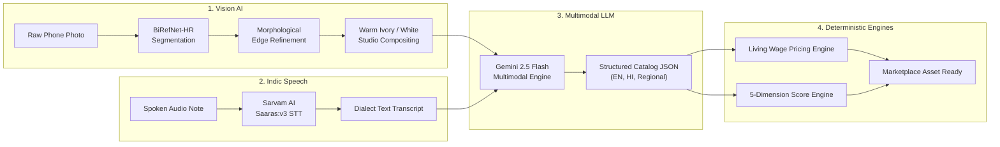

# Artisera AI & Machine Learning Pipeline

This document provides technical documentation for the AI models, computer vision pipelines, speech engines, and mathematical scoring systems integrated into Artisera.

---

## 1. AI Pipeline Overview

Artisera coordinates four specialized AI systems to transform a physical handcrafted item into a marketplace-ready digital asset:



---

## 2. Computer Vision: Studio Image Enhancement

### 2.1 Neural Segmentation Model
- **Primary Model**: `ZhengPeng7/BiRefNet_HR` (Hugging Face AutoModelForImageSegmentation).
- **Architecture**: Bilateral Reference Network for High-Resolution Dichotomous Image Segmentation.
- **Compute Framework**: PyTorch 2.1+, Torchvision 0.16.
- **Hardware Acceleration**:
  - **GPU (NVIDIA CUDA)**: Mixed precision `Float16` at 1024×1024 resolution.
  - **CPU**: Explicitly converted to `Float32` at 768×768 resolution to prevent half-precision CPU instruction faults.

### 2.2 Preprocessing & Mask Refinement
1. **EXIF Transpose**: Corrects native phone camera rotation flags (`ImageOps.exif_transpose`).
2. **Standard ImageNet Normalization**: Normalizes channels to $\mu = [0.485, 0.456, 0.406]$ and $\sigma = [0.229, 0.224, 0.225]$.
3. **Morphological Filtering**: A 3×3 elliptical structuring element (`cv2.MORPH_CLOSE`) seals micro-gaps without eroding delicate artisan details (e.g. textile tassels, wood fretwork, filigree brass).
4. **Gaussian Edge Anti-Aliasing**: Gentle 3×3 Gaussian blur smoothes the segmentation perimeter to eliminate jagged edges.

### 2.3 Studio Backdrop Compositing
- The isolated RGBA artifact is alpha-composited onto either **Artisera Signature Warm Ivory** (`#F7F3EA`) or **E-Commerce Pure White** (`#FFFFFF`).
- A soft Gaussian contact shadow is synthesized beneath the craft bounding box to prevent unrealistic "floating" cutout artifacts.

### 2.4 Non-Generative Image Enhancement
Artisera strictly **rejects diffusion-based repainting** to protect craft authenticity and prevent buyer returns:
- **Brightness**: $+3\%$ subtle lift (`ImageEnhance.Brightness(1.03)`).
- **Contrast**: $+5\%$ dynamic range expansion (`ImageEnhance.Contrast(1.05)`).
- **Color Saturation**: $+2\%$ natural tone preservation (`ImageEnhance.Color(1.02)`).
- **Sharpness**: $+10\%$ micro-texture clarity (`ImageEnhance.Sharpness(1.10)`).

### 2.5 Zero-GPU Node.js Fallback Pipeline
When the Python microservice is offline, the API Gateway activates its built-in Sharp engine (`src/ai/image/enhancer.ts`):
- Executes CLAHE (Contrast Limited Adaptive Histogram Equalization) in the L-channel of LAB color space.
- Applies unsharp masking and outputs high-quality web-optimized WebP or JPEG.

---

## 3. Indic Voice & Speech Pipeline

### 3.1 Speech-to-Text (STT)
- **Engine**: Sarvam AI `saaras:v3`.
- **Supported Languages**: Hindi (`hi-IN`), Bengali (`bn-IN`), Telugu (`te-IN`), Tamil (`ta-IN`), Marathi (`mr-IN`), Kannada (`kn-IN`), English (`en-IN`).
- **Input**: Multichannel audio clips (PCM, WAV, M4A, MP3) up to 25 MB.
- **Glossary Biasing**: Domain glossary terms for Indian crafts (e.g. "zari", "ikat", "dokra", "terracotta", "chanderi", "pashmina") improve transcription fidelity for rural dialects.

### 3.2 Text-to-Speech (TTS)
- **Engine**: Sarvam AI `mayura:v1`.
- **Functionality**: Reads generated descriptions, copilot scheme steps, and buyer messages aloud to low-literacy artisans in their native language.

---

## 4. Multimodal Catalog Generation Engine

### 4.1 Vision-Language Model
- **Primary Model**: Google Gemini 2.5 Flash (`gemini-2.5-flash`).
- **Alternative / Self-Hosted**: Qwen3-VL served via vLLM on AWS EC2 `g5.xlarge` (NVIDIA A10G).
- **Inference Temperature**: `0.2` (configured for factual precision, minimizing creative hallucination).

### 4.2 Structured Output Schema
The model receives the enhanced studio image and the artisan's voice transcript, generating a validated JSON payload:
```json
{
  "product_title": "String (English, max 100 chars)",
  "title_hi": "String (Hindi)",
  "category": "Standard handicraft category",
  "product_type": "Specific craft sub-type",
  "visible_material": "Primary raw material identified",
  "colors": ["Primary", "Accent"],
  "visual_attributes": ["Handmade texture", "Motif style"],
  "description": "Professional 3-paragraph e-commerce description",
  "description_hi": "Hindi description for domestic buyers",
  "short_description": "Single sentence summary for cards",
  "tags": ["SEO tags", "Material tags"],
  "seo_keywords": ["High-intent search queries"],
  "craft_story": "Authentic cultural context and artisan lineage",
  "care_instructions": ["Handling and maintenance steps"],
  "regional_descriptions": {
    "ta": "Tamil description",
    "te": "Telugu description",
    "bn": "Bengali description",
    "mr": "Marathi description",
    "kn": "Kannada description"
  }
}
```

---

## 5. Mathematical Pricing Engine

The deterministic pricing engine (`src/ai/pricing/pricingEngine.ts`) ensures artisans never sell below subsistence cost:

$$\text{Cost Floor} = C_{\text{materials}} + (T_{\text{hours}} \times W_{\text{living}}) + C_{\text{packaging}} + C_{\text{overhead}}$$

Where:
- $C_{\text{materials}}$ = Total invoice cost of raw materials.
- $T_{\text{hours}}$ = Direct hours spent crafting the piece.
- $W_{\text{living}}$ = State-adjusted artisan living wage (default ₹120–150/hour).
- $C_{\text{packaging}}$ = Protective wrapping and packaging cost.
- $C_{\text{overhead}}$ = Amortized tool wear, studio electricity, and transport.

### Tiered Price Multipliers
- **Minimum Fair Floor**: Non-negotiable cost floor (safety threshold).
- **Suggested Retail**: Cost Floor $\times (1 + \text{Margin}_{\text{category}} + \text{GI}_{\text{premium}})$.
  - *Textiles Margin*: $+40\%$
  - *Metal & Jewelry Margin*: $+45\%$
  - *Pottery & Clay Margin*: $+35\%$
  - *Woodcraft Margin*: $+40\%$
  - *GI Certification Premium*: $+10\text{ to }15\%$
- **Wholesale Tier**: Retail Price $\times 0.85$ (15% bulk concession with MOQ $\ge 20$).
- **Export Tier**: Retail Price $\times 1.25$ (accounting for international compliance, freight documentation, and customs duties).

---

## 6. Explainable Product Intelligence Scoring

Every product listing is evaluated across 5 dimensions, producing a transparent **0–100 Score**:

| Dimension | Weight | Evaluation Criteria |
|---|---|---|
| **Image Quality** | 25% | Resolution $\ge 1080$px, studio background present, lighting clarity, sharpness score. |
| **Catalog Quality** | 25% | Presence of craft technique, material specs, dimensions, care instructions, and craft story. |
| **Discoverability** | 20% | Keyword count $\ge 5$, bilingual title and description, valid category mapping. |
| **Pricing Competitiveness** | 15% | Selling price $\ge$ calculated cost floor; price within competitive benchmark percentile. |
| **Market Fit** | 15% | Category trend alignment, festive demand signals, inventory stock availability. |

---

## 7. Multilingual RAG Knowledge Base

The Artisan Copilot utilizes **Retrieval-Augmented Generation (RAG)** over verified government schemes:
- **Corpus**: Official documentation for PM Vishwakarma, Pradhan Mantri MUDRA Yojana, Pehchan Artisan ID, GeM Onboarding, and ONDC Listing Guidelines.
- **Embedding Store**: High-dimensional vector embeddings stored directly in Supabase PostgreSQL (`guide_knowledge_documents` table).
- **Provenance Enforcement**: Every AI advice response includes mandatory official citation metadata:
  - Official Government Portal URL
  - Policy Document Version
  - Last-Verified Date
