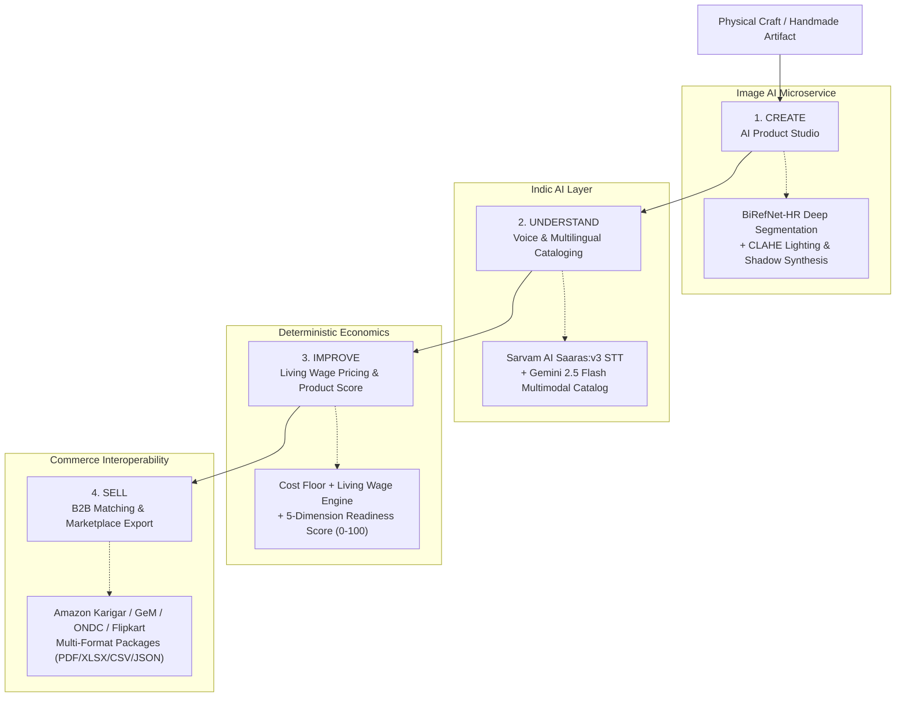
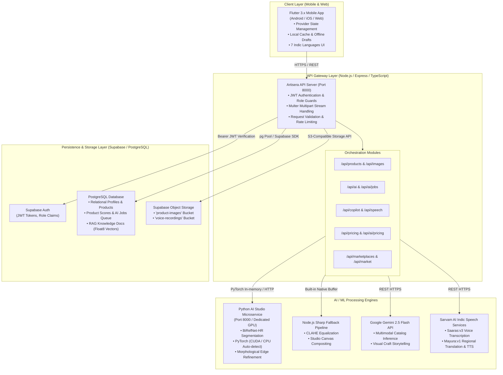

# Artisera System Architecture

This document details the complete end-to-end engineering architecture of **Artisera**, designed for **Smart India Hackathon 2026 (Problem Statement PS-26090)**: *AI-Driven Market Linkage and Smart Cataloging Mobile Application for Marginalized Artisans*.

---

## 1. Architectural Philosophy: "Create. Understand. Improve. Sell."

Traditional artisan commerce tools treat product upload as a static data-entry task. Marginalized rural artisans face significant barriers:
- Low digital literacy and non-English communication.
- Lack of professional photographic lighting or studio equipment.
- Inability to write SEO descriptions, market tags, or export manifests.
- Predatory middleman pricing due to lack of transparent cost calculations.

Artisera addresses these friction points by organizing the system architecture around a four-stage digital transformation pipeline:

---

## 2. High-Level Multi-Tier System Topology

Artisera adopts a decoupled microservice-backed architecture. The Flutter mobile app communicates strictly through a centralized Node.js/Express API Gateway, protecting database secrets and AI provider keys.

---

## 3. Subsystem Breakdown

### 3.1 Mobile Client Subsystem (`Mobile_App`)
- **Technology**: Flutter 3.13+, Dart 3.x.
- **State Management**: `Provider` architecture with reactive stores:
  - `AuthProvider`: Authentication state, user profile, role segregation (`artisan`, `buyer`, `admin`).
  - `CraftProvider`: Active product catalog, draft craft lifecycle, image selection, offline fallback, pricing parameters.
  - `LanguageProvider`: Dynamic switching between 7 supported languages without requiring app restart.
- **Audio & Media**:
  - `record`: Captures raw PCM/M4A audio from the artisan's microphone.
  - `image_picker`: Camera and gallery capture with phone orientation correction (`exif_transpose`).
  - `video_player`: Renders AI-generated marketing reels and craft process videos.
- **Resilience**: Client-side `CacheService` caches published crafts and artisan drafts in `SharedPreferences`, enabling seamless browsing during spotty rural 2G/3G connectivity.

### 3.2 Core Backend Subsystem (`Backend`)
- **Technology**: Node.js 20+, Express.js 4.19, TypeScript 5.8.
- **Role Guards & Security Middleware**:
  - `requireAuth`: Validates Supabase JWT Bearer token and attaches user identity to the request.
  - `requireArtisan`: Ensures only verified artisan accounts can create products, mutate pricing, or edit draft listings.
  - `requireBuyer`: Protects bulk purchasing and RFP submission flows.
  - `requireAdmin`: Enforces administrative isolation for platform analytics.
- **Dual Runtime Deployment**: Runs both as a persistent Node.js service (via `src/server.ts`) and as a serverless microservice compatible with Vercel deployment (via `api/index.ts`).

### 3.3 Computer Vision & Image Studio (`AI_Models` & `Backend/src/ai/image`)
Artisera implements a robust **two-tier image processing strategy**:
1. **Tier 1 (High-Fidelity Neural Segmentation)**: A dedicated Python FastAPI microservice (`AI_Models/app.py`) running `ZhengPeng7/BiRefNet_HR`. It runs inference at up to 1024×1024 resolution on NVIDIA CUDA GPUs (or 768×768 with float32 safety on CPU), produces probability masks, applies morphological ellipse smoothing, and composites the artifact on studio ivory (`#F7F3EA`) or pure e-commerce white (`#FFFFFF`) with Gaussian contact shadows.
2. **Tier 2 (Zero-GPU Serverless Fallback)**: The Node.js API gateway contains a built-in image processor (`src/ai/image/enhancer.ts`) using libvips/Sharp. If the Python GPU worker is unreachable, the gateway executes CLAHE (Contrast Limited Adaptive Histogram Equalization), noise reduction, edge sharpening, and auto-cropping without dropping the user's request.

### 3.4 Indic Multimodal & Speech Engine (`Backend/src/routes/speech.ts` & `src/routes/ai.ts`)
- **Speech-to-Text**: Raw artisan voice recordings are dispatched to Sarvam AI's `saaras:v3` model, transcribing rural dialects into accurate native script.
- **Multimodal Listing Synthesis**: Google Gemini 2.5 Flash receives the studio product photograph alongside the transcribed artisan voice description. The model extracts craft technique, material, color palette, dimensions, and craft story, returning structured JSON with English, Hindi, and regional translations.
- **Text-to-Speech**: Catalog descriptions and copilot advisories can be synthesized back into natural Indic speech via Sarvam's `mayura:v1` engine.

### 3.5 Deterministic Fair Pricing Engine (`Backend/src/ai/pricing/pricingEngine.ts`)
Unlike unpredictable black-box neural pricing that might undercut an artisan's labor, Artisera enforces a deterministic **Cost-Floor + Living Wage** formula:
$$\text{Cost Floor} = \text{Raw Materials} + (\text{Labor Hours} \times \text{Hourly Living Wage}) + \text{Tool Amortization} + \text{Packaging \& Logistics}$$
$$\text{Fair Retail Price} = \frac{\text{Cost Floor}}{1 - \text{Base Margin}} \times (1 + \text{GI Tag Premium} + \text{Complexity Multiplier})$$
This mathematical guarantee ensures that artisans never sell below subsistence cost.

### 3.6 Multilingual Artisan Copilot & RAG Knowledge Base (`Backend/src/services/copilot`)
The Copilot guides artisans through complex government schemes and marketplace compliance:
- **Knowledge Documents**: Pre-embedded vector documents stored in Supabase PostgreSQL covering:
  - **PM Vishwakarma Scheme** (18 traditional trades, collateral-free credit, ₹15,000 toolkits).
  - **Pradhan Mantri MUDRA Yojana** (Shishu, Kishore, Tarun loan tiers).
  - **Pehchan ID Card** (National artisan identification card process).
  - **Fair-Trade Pricing & Marketplace Listing Guidelines**.
- **Interactive Task Sessions**: Step-by-step state machine tracking progress (`in_progress`, `completed`) with language-specific prompts and external navigation links.

### 3.7 Marketplace Export Subsystem (`Backend/src/services/marketplaceExport.ts`)
Converts internal Artisera product records into official marketplace listing packages:
- **Supported Channels**: Amazon Karigar, GeM (Government e-Marketplace), ONDC (Open Network for Digital Commerce), Etsy India, Flipkart Samarth, and Meesho.
- **Export Formats**: Structured Excel (`.xlsx`), CSV (`.csv`), downloadable PDF listing dossier (`.pdf`), and Beckn-compliant JSON (`.json`).
- **Readiness Auditing**: Validates presence of mandatory channel-specific attributes (e.g. HSN codes, GST rates, package dimensions, return policies) and scores readiness from 0% to 100%.

---

## 4. Failure Modes & Resilience Strategies

| Subsystem | Potential Failure | Graceful Mitigation |
|---|---|---|
| **Image AI Microservice** | GPU microservice offline or timeout (>30s) | Backend seamlessly fails over to Node.js Sharp CLAHE pipeline; user still receives an enhanced image. |
| **Multimodal LLM** | Gemini API rate limit or network outage | Deterministic rule-based catalog generator produces standard craft titles, keywords, and story templates. |
| **Indic Speech STT** | Sarvam API unreachable | App allows direct manual entry and voice note persistence in Supabase storage for later re-transcription. |
| **Database Network** | Spotty 2G/3G connectivity in rural clusters | Flutter client caches marketplace products and stores new creations in local device storage until reconnected. |
