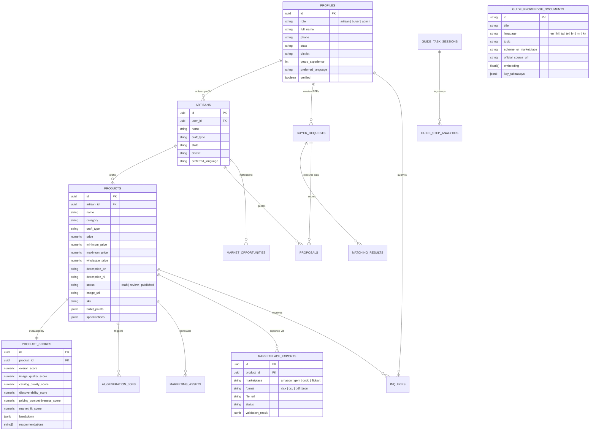

# Artisera Database Schema & Storage

This document outlines the **PostgreSQL / Supabase** relational database schema, indexes, Row Level Security (RLS) policies, and Object Storage configurations powering Artisera.

---

## 1. Entity-Relationship Model (Mermaid ERD)

---

## 2. Table Specifications

### 2.1 Core Identity & Profiles (`profiles` & `artisans`)
- `profiles`: Primary table extending `auth.users`. Holds role-based credentials (`artisan`, `buyer`, `admin`), KYC verification status, craft heritage background, languages spoken, and preferred language code.
- `artisans`: Domain-specific view mapping an artisan identity to geographical craft clusters, village locations, and association memberships.

### 2.2 Product Catalog (`products`)
Stores the canonical digital twin of the physical craft.
- **Identity & Taxonomy**: `id`, `artisan_id`, `name`, `short_title`, `category`, `subcategory`, `product_type`, `craft_type`, `material`, `region`.
- **Pricing & Economics**: `price` (selling), `mrp`, `minimum_price` (living wage floor), `maximum_price`, `wholesale_price`, `material_cost`, `labor_cost`, `production_cost`.
- **Content & Story**: `description_en`, `description_hi`, `craft_story`, `voice_transcript`, `keywords`, `bullet_points`, `care_instructions`.
- **Compliance & Logistics**: `sku`, `hsn_code`, `gst_rate`, `country_of_origin`, `dimensions` (JSONB), `weight` (JSONB), `stock_quantity`, `lead_time_days`, `manufacturer_details` (JSONB).
- **Lifecycle & Auditing**: `status` (`draft`, `review`, `published`, `archived`), `ai_generated` (bool), `ai_confidence` (numeric), `created_at`, `updated_at`.

### 2.3 Explainable Product Score (`product_scores`)
Provides an explainable 0-100 rating across 5 crucial e-commerce dimensions:
- `overall_score`: Weighted index of listing readiness.
- `image_quality_score`: Lighting, angle, focus, studio background clarity.
- `catalog_quality_score`: Specification richness, craft technique description.
- `discoverability_score`: SEO keyword presence, regional tags.
- `pricing_competitiveness_score`: Alignment with market demand and living wage standards.
- `market_fit_score`: Seasonal relevance and category velocity.
- `recommendations`: Actionable text suggestions for the artisan.

### 2.4 Multi-Marketplace Compliance (`marketplace_templates` & `marketplace_exports`)
- `marketplace_templates`: Canonical schema specifications for Amazon Karigar, GeM, ONDC, Flipkart Samarth, and Meesho, including required headers, data types, and validation rules.
- `marketplace_exports`: Historical log of all generated listing packages, storing readiness score at time of generation, validation errors, and download links.

### 2.5 Multilingual Artisan Guide (`guide_knowledge_documents` & `guide_task_sessions`)
- `guide_knowledge_documents`: Curated knowledge documents for government artisan schemes (PM Vishwakarma, MUDRA, Pehchan) with high-dimensional vector embeddings (`FLOAT8[]`), official government portal source URLs, and last-verified timestamps.
- `guide_task_sessions`: Tracks interactive workflow progress step-by-step (`in_progress`, `completed`), ensuring artisans receive contextual guidance suited to their craft.
- `guide_step_analytics`: Logs completion rates per step to identify drop-off friction points.

### 2.6 B2B Commerce & Linkage (`buyer_requests`, `inquiries`, `proposals`)
- `buyer_requests`: B2B procurement RFPs submitted by corporate gifting teams, export houses, and retail chains.
- `inquiries`: Direct messaging and quotation inquiries between prospective buyers and artisans.
- `proposals`: Formal quotes with unit price, minimum quantity, lead time, and payment terms submitted by artisans.

---

## 3. Storage Buckets & Policies

Supabase Object Storage is organized into two primary public-read/auth-write buckets:

| Bucket Name | Purpose | Max Size | Allowed MIME Types |
|---|---|---|---|
| `product-images` | Stores raw uploaded photos, segmented studio images, and social variation assets. | 10 MB | `image/jpeg`, `image/png`, `image/webp` |
| `voice-recordings` | Stores artisan spoken audio notes for cataloging and transcription verification. | 25 MB | `audio/m4a`, `audio/mp4`, `audio/wav`, `audio/mpeg` |

---

## 4. Row Level Security (RLS) Policies

All tables have RLS enabled to guarantee data sovereignty and prevent unauthorized cross-tenant data access:

1. **Profiles**:
   - `auth.uid() = id`: Users can update and manage only their own profile.
   - `SELECT USING (true)`: Public profile viewing for verified artisan craft discovery.
2. **Products**:
   - `artisan_id IN (SELECT id FROM artisans WHERE user_id = auth.uid())`: Artisans can insert, update, or delete only their own products.
   - `SELECT USING (status = 'published' OR artisan_id IN (...))`: Published products are readable by everyone (including prospective buyers); draft/review products are private to the owning artisan.
3. **Inquiries & Proposals**:
   - Access is strictly restricted to participating buyers and target artisans.
