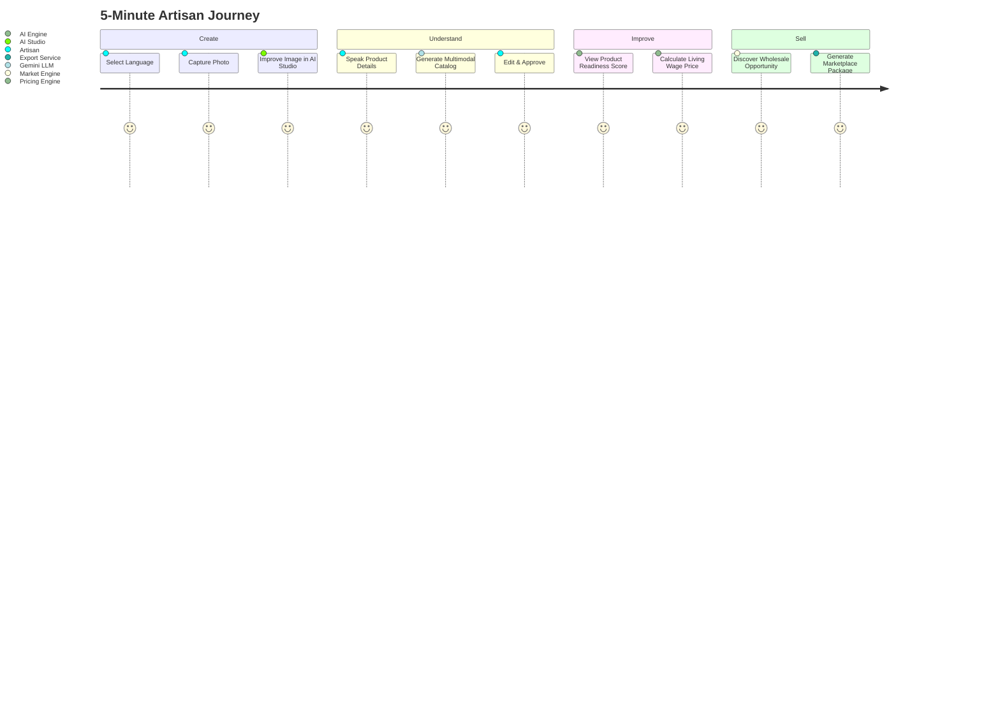

# Artisera 5-Minute Evaluator Demo Script

This script provides an exact, step-by-step walkthrough for evaluators to test Artisera's complete **"Create. Understand. Improve. Sell."** workflow within 5 minutes.

---

## 🎬 5-Minute End-to-End Walkthrough

---

### Step 1 — Select Language
- **Screen**: `LanguageSelectionScreen`
- **Action**: Open the mobile app. Select your preferred native language (e.g., **हिन्दी (Hindi)**, **English**, **বাংলা (Bengali)**, or **தமிழ் (Tamil)**).
- **Under the Hood**: `LanguageProvider` switches the application translation dictionary instantly without network reload. Complete UI, labels, and audio cues adapt to the chosen Indic language.

---

### Step 2 — Capture Product
- **Screen**: `HomeScreen` $\rightarrow$ `CameraScreen` / `AddCraftScreen`
- **Action**: Tap the **"+" (Add Craft)** button. Point your camera at a physical handcrafted artifact (or choose a photo from the gallery).
- **Under the Hood**: Camera captures the raw photo, transposes EXIF orientation metadata, and creates a local draft record (`CraftProduct`).

---

### Step 3 — Improve Image
- **Screen**: `AIStudioScreen`
- **Action**: Tap **"Enhance Photo"**.
- **Under the Hood**: The photo is dispatched to the **BiRefNet-HR** microservice (or the Sharp fallback). The model performs dichotomous segmentation, isolates the craft from cluttered home/workshop backgrounds, smooths perimeter edges with morphological filtering, and composites the artifact on a signature warm ivory (`#F7F3EA`) or e-commerce white background with simulated contact shadows.

---

### Step 4 — Speak Product Details
- **Screen**: `AddCraftScreen` (Voice Tab)
- **Action**: Hold the microphone button and describe the craft in your natural language (e.g., *"Yeh pure terracotta clay ka diya hai, hath se banaya hua"*).
- **Under the Hood**: The audio recording is sent to Sarvam AI's `saaras:v3` Indic speech model, returning a precise dialect transcript with craft glossary recognition.

---

### Step 5 — Generate Catalog
- **Screen**: `ReviewScreen`
- **Action**: Tap **"Generate AI Catalog"**.
- **Under the Hood**: Gemini 2.5 Flash processes the studio image alongside the voice transcript. It generates:
  - English & Hindi e-commerce titles
  - Craft story highlighting traditional heritage
  - Detailed material specifications and care instructions
  - High-intent SEO keywords and regional language translations

---

### Step 6 — Edit & Approve
- **Screen**: `ReviewScreen`
- **Action**: Review the generated title, specifications, and descriptions. Make any manual edits directly in the text fields.
- **Under the Hood**: Enforces human-in-the-loop governance. The listing remains in `status: 'review'` until the artisan explicitly approves.

---

### Step 7 — View Product Score
- **Screen**: `ReviewScreen` / `ProductDetailScreen`
- **Action**: Inspect the **Catalog Readiness Score (0–100)** badge.
- **Under the Hood**: The 5-dimension scoring engine evaluates image quality (25%), catalog richness (25%), discoverability (20%), pricing competitiveness (15%), and market fit (15%), providing actionable recommendations for listing enhancement.

---

### Step 8 — Get Price Guidance
- **Screen**: `PricingScreen`
- **Action**: Input raw material costs (e.g. ₹450) and crafting hours (e.g. 8 hours). Tap **"Calculate Fair Price"**.
- **Under the Hood**: The deterministic pricing engine computes a living wage cost floor, adds category-specific margins, applies GI-certification premiums, and recommends wholesale, retail, and export pricing tiers. Tap **"Publish to Marketplace"**.

---

### Step 9 — Discover Market Opportunity
- **Screen**: `LeadsScreen` / `MarketScreen`
- **Action**: Switch to the **Leads** tab. View matched B2B buyer requirements and corporate procurement RFPs.
- **Under the Hood**: The 5-factor matching algorithm ranks incoming bulk buyer requests against the artisan's craft category, production capacity, and geographical proximity.

---

### Step 10 — Create Marketing Asset & Export
- **Screen**: `ProductDetailScreen` $\rightarrow$ **Export Channel**
- **Action**: Tap **"Export Listing"** and select **Amazon Karigar**, **GeM**, or **ONDC**.
- **Under the Hood**: The export engine validates channel-specific compliance requirements and generates a downloadable **listing package** (`.xlsx`, `.csv`, `.pdf`, or `.json`) ready for one-tap seller upload.
