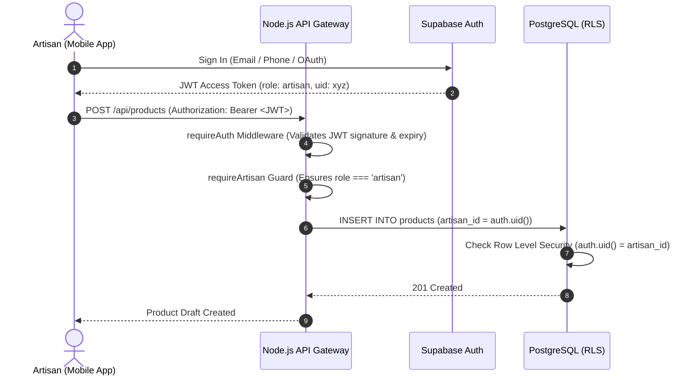

# Security, Privacy & Responsible AI Architecture

This document details the security model, cryptographic authentication policies, secret management, and responsible AI guardrails implemented across Artisera.

---

## 1. Threat Model & Key Security Objectives

Artisera serves rural artisans who are vulnerable to digital exploitation, predatory middleman pricing, and identity manipulation. The platform enforces five foundational security objectives:

1. **Artisan Sovereignty**: Artisans own and retain complete control over their craft images, cultural stories, and listing data.
2. **Confidential Cost Quarantining**: Private production costs, raw material expenses, and personal wage calculations are strictly isolated on the backend and are **never exposed** to retail consumers or wholesale buyers.
3. **Prevention of AI Hallucination & Counterfeits**: Product photos are never repainted or synthesized using generative diffusion; authentic craft flaws and handmade textures are preserved.
4. **Secret Isolation**: Zero cloud provider keys or administrative database credentials are embedded inside the Flutter client bundle.
5. **Verified Provenance**: Government scheme guidelines, compliance advisories, and loan schemes link strictly to official government portals with timestamped document versions.

---

## 2. Authentication & Authorization (RBAC + JWT)

Artisera implements a defense-in-depth authorization model using **Supabase Auth** and **Express.js API Gateway Middleware**:



### Role-Based Guards
- **`requireAuth`**: Validates the cryptographic signature of the Bearer token against Supabase JWT secret. Attaches user context to `req.user`.
- **`requireArtisan`**: Enforces that only accounts registered with an artisan profile can initiate catalog generation, pricing runs, and listing publications.
- **`requireBuyer`**: Grants access to B2B bulk request for proposals (RFPs) and inquiry dispatch.
- **`requireAdmin`**: Isolates platform moderation and aggregated economic metric dashboards.
- **`requireVerifiedProfile`**: Additional guard applied to high-trust actions (e.g. publishing to national GeM export feeds).

---

## 3. Database Security & Row Level Security (RLS)

All PostgreSQL tables enforce Row Level Security. Even if an attacker compromises the API layer or submits malformed IDs, PostgreSQL rejects unauthorized data access at the engine level:

- **Products Table**:
  ```sql
  CREATE POLICY "Artisan product isolation" ON public.products
  FOR ALL TO authenticated
  USING (artisan_id IN (SELECT id FROM public.artisans WHERE user_id = auth.uid()))
  WITH CHECK (artisan_id IN (SELECT id FROM public.artisans WHERE user_id = auth.uid()));

  CREATE POLICY "Public read for published products" ON public.products
  FOR SELECT USING (status = 'published');
  ```
- **Inquiries & Proposals**:
  Strictly restricted to the specific buyer who initiated the request and the target artisan responding to it.

---

## 4. Secret Management & Separation of Concerns

Artisera strictly categorizes environment variables into two tiers:

| Tier | Variables | Exposure Risk | Permitted Location |
|---|---|---|---|
| **Client-Safe** | `SUPABASE_URL`<br/>`SUPABASE_ANON_KEY` | Public-safe by design; limited by PostgreSQL RLS. | Flutter app (`ApiConfig.dart`), mobile assets. |
| **Server-Only (Private)** | `SUPABASE_SERVICE_ROLE_KEY`<br/>`DATABASE_URL`<br/>`GEMINI_API_KEY`<br/>`SARVAM_API_KEY`<br/>`VLLM_API_KEY` | **CRITICAL**. Grants administrative database bypass and billable API consumption. | Node.js Backend `.env` only. **NEVER included in mobile binaries.** |

---

## 5. Responsible AI Guardrails

### 5.1 Non-Generative Image Preservation
E-commerce platforms frequently fail artisans when AI "enhancers" repaint the craft (e.g., changing embroidery stitches or altering wood grain).
- **Artisera Policy**: The computer vision pipeline performs **background segmentation, perspective de-skew, studio canvas compositing, and conservative CLAHE contrast adjustment**.
- **Generative Repainting Disabled**: The system **never** applies inpainting or stable diffusion generative textures to the craft itself, preventing counterfeit product listings and customer disputes.

### 5.2 Human-in-the-Loop Governance
No AI output is published autonomously:
- Catalog titles, descriptions, and regional translations generated by Gemini are marked as `status: 'review'` and presented in editable text fields.
- The calculated fair living wage price is presented as a **recommendation**; the artisan retains the final authority to adjust or override the selling price.

### 5.3 Cost Data Isolation
Under no circumstances are `material_cost`, `labor_hours`, or `hourly_living_wage` returned in public marketplace queries (`/api/market/products`). Cost calculations are quarantined to the artisan's private dashboard.

### 5.4 AI Transparency & Fact-Checking
- AI-generated metadata is transparently tagged with `ai_generated: true` and an acoustic/vision confidence score.
- The Multilingual Copilot strictly cites verified government source URLs and policy document versions for every scheme recommendation (PM Vishwakarma, MUDRA, Pehchan).
